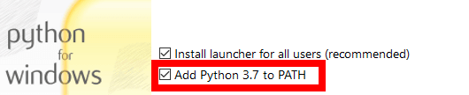

### [vonas.github.io/thk-mci](https://vonas.github.io/thk-mci/)
Funktionaler Prototyp für das Praktikum in Mensch-Computer Interaktion an der TH Köln

### Webseite lokal ausführen
Falls noch nicht geschehen, gehe auf [python.org/downloads](https://www.python.org/downloads/) und lade dir die neueste Version von Python herunter (`>=3.8.3`). Installiere das Programm und stelle sicher, dass Python deinem PATH hinzugefügt wird:



Öffne nach der Installation eine Kommandozeile (`cmd.exe` auf Windows, dein Terminal-Emulator auf Linux) im Ordner `thk-mci` (der Ordner dieses Repos) und gebe den folgenden Befehl ein:

```
python -m http.server -d docs/ 8000
```

Damit startest du einen lokalen HTTP-Server, mit welchem du auf dieselbe Weise auf die Seite zugreifen kannst, wie über [vonas.github.io/thk-mci](https://vonas.github.io/thk-mci/). Das hat [einige Vorteile](https://developer.mozilla.org/en-US/docs/Learn/Common_questions/set_up_a_local_testing_server#The_problem_with_testing_local_files) gegenüber dem direkten Öffnen einer Datei im Browser.

Die Seite ist über [localhost:8000](http://localhost:8000/) erreichbar.
